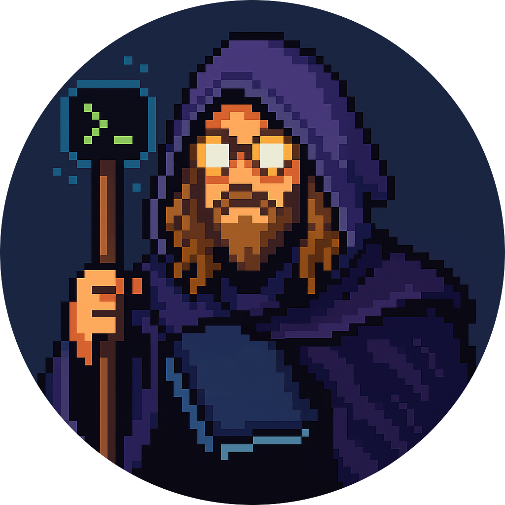

<!-- Language Switch -->

[Lire en Français](./README_FR.md)

> (WIP)  

  

  <h1>Hello, World!</h1>
  
I'm Ced, a developer, maker, and digital tinkerer based in Québec.

---

## 👨‍💻 About Me

I'm a junior developer with a passion for clean, modular, and scalable code.  
At [42 Québec](https://www.42quebec.com), I grew strong in problem-solving, project-based learning, and technical teamwork.

**Languages & Tools I Use Most**:  
C, C++, Bash, TypeScript, Makefiles, Git, Docker

I love automating workflows, writing utility scripts, and building reusable components — whether for shell scripts or game dev experiments.

<!--
Hi! I'm a passionate developer with a love for problem-solving and learning new technologies.  
I studied at 42 Québec, where I developped my technical and collaborative skills through intensive project-based learning.

I am proficient in C/C++ (C++98) and possess a strong understanding of object-oriented programming principles.

I am a firm believer in clean, modular, and scalable code, and have a deep appreciation for automation.  
I extensively use Makefiles and Bash scripting to streamline workflows, generate assets and enhance development efficiency.

I also enjoy creating reusable utility classes and wrapper functions to enhance code readability and maintainability.
-->

---

## 🎮 Current Projects

### [ColorGame](https://github.com/SaydRomey/ColorGame)  
I'm building a color-themed universe for a future video game — from lore and mythology to NPC archetypes and core mechanics.  

> [NOTE!]  
> *(The ColorGame repo might be private at the moment... work in progress and all, you know.)*  

### [GodotPlayground](https://github.com/SaydRomey/GodotPlayground)  
An experimental space for gameplay mechanics, level design, and scripting in Godot.

> I am also documenting my previous projects on my github,  
> getting familiar with markdown and a little html in the process!

---

## 🏁 42 Common Core Projects

| Project | Description |
|---------|-------------|
| **[Libft](https://github.com/SaydRomey/libft)** | A custom implementation of essential C library functions. |
| **[get_next_line](https://github.com/SaydRomey/get_next_line)** | A program to read a line from a file descriptor, one at a time. |
| **[ft_printf](https://github.com/SaydRomey/ft_printf)** | A recreation of the `printf` function with advanced formatting capabilities. |
| **[Born2beroot](https://github.com/SaydRomey/B2BR)** | Setting up a secure virtual server environment with Linux. |
| **[pipex](https://github.com/SaydRomey/pipex)** | A reproduction of the Unix `pipe` and redirection functionalities. |
| **[push_swap](https://github.com/SaydRomey/push_swap)** | Sorting algorithm project using two stacks and a limited set of operations. |
| **[Philosophers](https://github.com/SaydRomey/Philosopher)** | A concurrent programming exercise exploring threads and mutexes. |
| **[FdF](https://github.com/SaydRomey/FdF)** | A 3D wireframe representation of landscapes using the MLX library. |
| **[minishell](https://github.com/SaydRomey/Minishell)** | A functional shell implementation in C, supporting basic Unix commands. |
| **[cub3D](https://github.com/SaydRomey/cub3D)** | A raycasting-based 3D game inspired by Wolfenstein 3D. |
| **[NetPractice](https://github.com/SaydRomey/netpractice)** | An introduction to networking concepts and configurations. |
| **[ft_irc](https://github.com/SaydRomey/ft_irc)** | Building an IRC server from scratch with C++. |
| **[Inception](https://github.com/SaydRomey/inception)** | Setting up a Docker-based multi-service application. |
| **[CPP Modules](https://github.com/SaydRomey/CPP)** | A deep dive into object-oriented programming using C++98. |
| **[ft_transcendence](https://github.com/SaydRomey/ft_transcendence)** | A Pong-inspired web app. |

> Projects written in **C** required a specific [coding norm](https://github.com/SaydRomey/42_ressources/blob/main/pdf/norm_en_v4.pdf)

### Exams
- **[Exam Repository](https://github.com/SaydRomey/exams)**: Personal solutions for 42 exams with an exam simulator.

---

## 📊 GitHub Stats

  
  

---

## 🛠️ Tech & Tools

  
  
  
  
  
  
  

---

## 📬 Contact

I'm always happy to connect and collaborate:

- 📧 Email: **cdumais@programmer.net**  
- 💼 [LinkedIn](https://www.linkedin.com/in/cedericdumais)

  
  

---

<!-- Status ideas
About to understand...
Understanding adjacent...
Knows just enough to ask better questions...
🦕
Version controlled since the Triassic... 
Jurasscript enabled.
Coding in C like extinction isn't real.
-->
