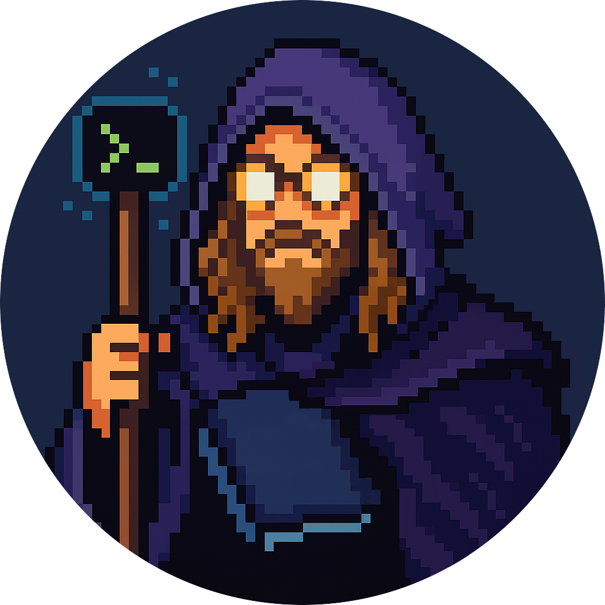

<!-- Language Switch -->

[Lire en Français](./README_FR.md)

> (WIP)  

  

  <h1>Hello, World!</h1>
  
I'm Ced, a developer, maker, and digital tinkerer based in Québec.

---

## 👨‍💻 About Me

I'm a junior developer with a passion for clean, modular, and scalable code.  
At [42 Québec](https://www.42quebec.com), I grew strong in problem-solving, 
project-based learning, and technical teamwork.  

I love automating workflows, writing utility scripts, documenting, 
and building reusable components — 
whether for scripting or game dev experiments.

---

## 🎮 Current Projects

<!-- ### [BabyTracker]()
Fun fact: I just became a dad!  
This project is meant to be a data tracking and organizer i can use 
to keep track of baby-related events and information.  -->

### [PythonPlayground](https://github.com/SaydRomey/PythonPlayground)  
An experimental space for some apps, tools, scripts and tests 
as I finally join the cool kids and learn Python.

### [ColorGame](https://github.com/SaydRomey/ColorGame)  
I'm building a color-themed universe for a future video game — 
from lore and mythology to NPC archetypes and core mechanics.  

This is mostly a writing and world-building project at its current stage.

> [!WARNING] W.I.P.  
> *(The ColorGame repo might be private at the moment... 
> work in progress and all, you know.)*  

---

## 🏁 42 Common Core Projects

| Project                                                               | Description                                                                  |
| --------------------------------------------------------------------- | ---------------------------------------------------------------------------- |
| **[Libft](https://github.com/SaydRomey/libft)**                       | A custom implementation of essential C library functions.                    |
| **[get_next_line](https://github.com/SaydRomey/get_next_line)**       | A program to read a line from a file descriptor, one at a time.              |
| **[ft_printf](https://github.com/SaydRomey/ft_printf)**               | A recreation of the `printf` function with advanced formatting capabilities. |
| **[Born2beroot](https://github.com/SaydRomey/B2BR)**                  | Setting up a secure virtual server environment with Linux.                   |
| **[pipex](https://github.com/SaydRomey/pipex)**                       | A reproduction of the Unix `pipe` and redirection functionalities.           |
| **[push_swap](https://github.com/SaydRomey/push_swap)**               | Sorting algorithm project using two stacks and a limited set of operations.  |
| **[Philosophers](https://github.com/SaydRomey/Philosopher)**          | A concurrent programming exercise exploring threads and mutexes.             |
| **[FdF](https://github.com/SaydRomey/FdF)**                           | A 3D wireframe representation of landscapes using the MLX library.           |
| **[minishell](https://github.com/SaydRomey/Minishell)**               | A functional shell implementation in C, supporting basic Unix commands.      |
| **[cub3D](https://github.com/SaydRomey/cub3D)**                       | A raycasting-based 3D game inspired by Wolfenstein 3D.                       |
| **[NetPractice](https://github.com/SaydRomey/netpractice)**           | An introduction to networking concepts and configurations.                   |
| **[ft_irc](https://github.com/SaydRomey/ft_irc)**                     | Building an IRC server from scratch with C++.                                |
| **[Inception](https://github.com/SaydRomey/inception)**               | Setting up a Docker-based multi-service application.                         |
| **[CPP Modules](https://github.com/SaydRomey/CPP)**                   | A deep dive into object-oriented programming using C++98.                    |
| **[ft_transcendence](https://github.com/SaydRomey/ft_transcendence)** | A Pong-inspired web app.                                                     |

> Projects written in **C** required a specific [coding norm](https://github.com/SaydRomey/42_ressources/blob/main/pdf/norm_en_v4.pdf)

### Exams
- **[Exam Repository](https://github.com/SaydRomey/exams)**: 
    Personal solutions for 42 exams with an exam simulator.

Click here!

---

## 📊 GitHub Stats

  
  
  
  <!--  -->

---

## 🛠️ Tech & Tools

  
  
  
  
  
  
  
  
  

---

## 📬 Contact

I'm always happy to connect and collaborate:

- 📧 Email: **cdumais@programmer.net**  
- 💼 [LinkedIn](https://www.linkedin.com/in/cedericdumais)

  
  

---

  

  
  

<table>
  <tr>
  <td style="vertical-align: top; padding-right: 1rem;">
    
    

  </td>
  <td style="vertical-align: top;">
    <table>
    <tr>
      <td style="padding-right: 0.5rem;"><strong>Name</strong>:</td>
      <td>Sayd</td>
    </tr>
    <tr>
      <td style="padding-right: 0.5rem;"><strong>Class</strong>:</td>
      <td>Shell-wielding dev mage</td>
    </tr>
    <tr>
      <td style="padding-right: 0.5rem;"><strong>Subclass</strong>:</td>
      <td>Makefile scholar, arcane game tinkerer, Linux technomancer</td>
    </tr>
    </table>
  </td>
  </tr>
</table>
<table>
  <tr>
  <td style="padding-right: 0.5rem; vertical-align: top;"><strong>Skills</strong>:</td>
  <td>
    Script Smithing – Hand-forges Bash incantations. 
    Workflow Alchemy – Transmutes chaos into reusable scripts. 
    Automation Runes – Etches <code>.sh</code> rituals that banish tedium and summon order. 
    Daemon Whispering – Talks to background processes. They sometimes talk back.
  </td>
  </tr>
<tr>
  <td style="padding-right: 0.5rem; vertical-align: top;"><strong>Inventory</strong>:</td>
  <td>
    +1 Makefile 
    Shell wand (bound to <code>~/bin</code>) 
    <code>.bash_history</code> scroll 
    Uncompiled dream shards of a 2D game 
    Half-mapped levels and gravity experiments 
    A well-worn 42 spellbook (<code>cdumais’s Grimoire of the Common Core</code>)
  </td>
  </tr>
  <tr>
  <td style="padding-right: 0.5rem; vertical-align: top;"><strong>Active Quests</strong>:</td>
  <td>
    Refactor the Ancient Scripts (with annotations this time) 
    Document the Forgotten Projects before they fade 
    Discover the Hidden Job Board of Sysadminia 
    Tame the input beasts of multi-dimensional game realms
  </td>
  </tr>
  <tr>
  <td style="padding-right: 0.5rem; vertical-align: top;"><strong>Known Bugs</strong>:</td>
  <td>
    Occasionally casts <code>rm -rf</code> too confidently 
    Believes every script deserves version control 
    Talks to daemons in public 
    Too many terminal tabs, too little RAM 
    Wears headphones like armor against chaotic frequencies 
    Easily startled by audio crits; Proximity debuff active
  </td>
  </tr>
</table>

<strong>Achievements</strong>:

  

